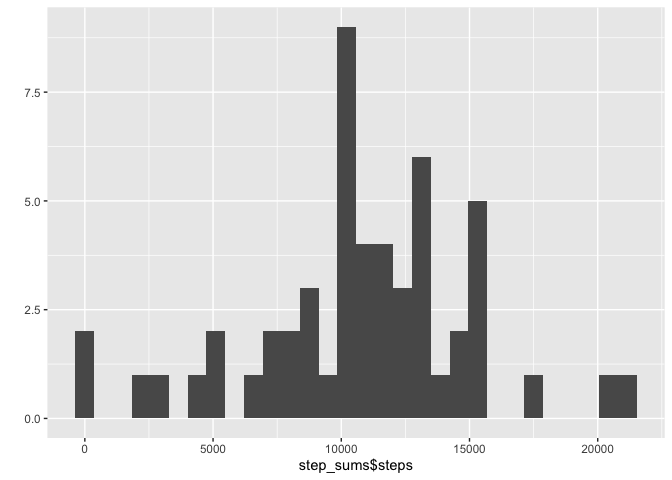
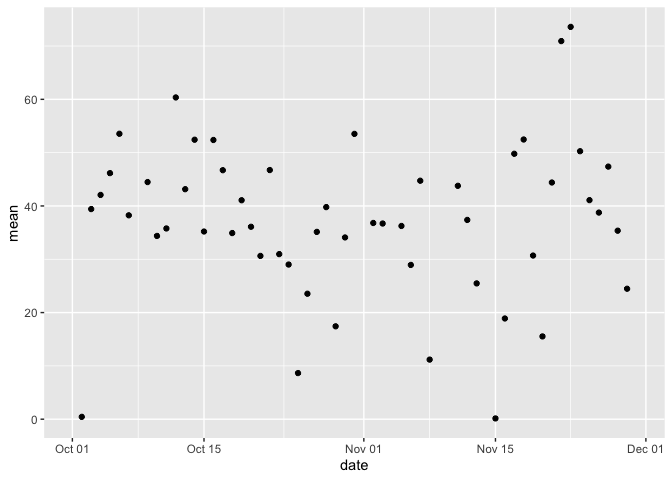

```r
knitr::opts_chunk$set(cache = TRUE)

library(readr)
library(magrittr)
library(ggplot2)
library(dplyr)
```

```
## 
## Attaching package: 'dplyr'
```

```
## The following objects are masked from 'package:stats':
## 
##     filter, lag
```

```
## The following objects are masked from 'package:base':
## 
##     intersect, setdiff, setequal, union
```

```r
setwd("/Users/ashipunova/work/data_science_coursera/intro_r/RepData_PeerAssessment1/")
```

## Loading and preprocessing the data

```r
# unzip("sales.zip", list = TRUE)
activity_data <- readr::read_csv(unzip("activity.zip", "activity.csv"))
```

```
## 
## ── Column specification ────────────────────────────────────────────────────────
## cols(
##   steps = col_double(),
##   date = col_date(format = ""),
##   interval = col_double()
## )
```

```r
str(activity_data)
```

```
## tibble [17,568 × 3] (S3: spec_tbl_df/tbl_df/tbl/data.frame)
##  $ steps   : num [1:17568] NA NA NA NA NA NA NA NA NA NA ...
##  $ date    : Date[1:17568], format: "2012-10-01" "2012-10-01" ...
##  $ interval: num [1:17568] 0 5 10 15 20 25 30 35 40 45 ...
##  - attr(*, "spec")=
##   .. cols(
##   ..   steps = col_double(),
##   ..   date = col_date(format = ""),
##   ..   interval = col_double()
##   .. )
```

```r
# transform(activity_data, date = ymd(date))
```


## What is mean total number of steps taken per day?


```r
step_sums <- aggregate(steps ~ date, activity_data, sum, na.rm = T)
sum_plot <- qplot(step_sums$steps, geom = "histogram") 
print(sum_plot)
```

```
## `stat_bin()` using `bins = 30`. Pick better value with `binwidth`.
```

<!-- -->

```r
activity_data %>%
  group_by(date) %>%
  summarise(
    #sum = sum(steps, na.rm = T), 
            mean = mean(steps, na.rm = T), 
            median = median(steps, na.rm = T)) -> mean_med
```

```
## `summarise()` ungrouping output (override with `.groups` argument)
```

```r
print(mean_med)
```

```
## # A tibble: 61 x 3
##    date          mean median
##    <date>       <dbl>  <dbl>
##  1 2012-10-01 NaN         NA
##  2 2012-10-02   0.438      0
##  3 2012-10-03  39.4        0
##  4 2012-10-04  42.1        0
##  5 2012-10-05  46.2        0
##  6 2012-10-06  53.5        0
##  7 2012-10-07  38.2        0
##  8 2012-10-08 NaN         NA
##  9 2012-10-09  44.5        0
## 10 2012-10-10  34.4        0
## # … with 51 more rows
```

```r
qplot(date, mean, data = mean_med)
```

```
## Warning: Removed 8 rows containing missing values (geom_point).
```

<!-- -->

```r
#step_means_medians <- 
# qplot(date, steps, data = step_means, geom = "smooth")
```

## What is the average daily activity pattern?


## Imputing missing values


## Are there differences in activity patterns between weekdays and weekends?
