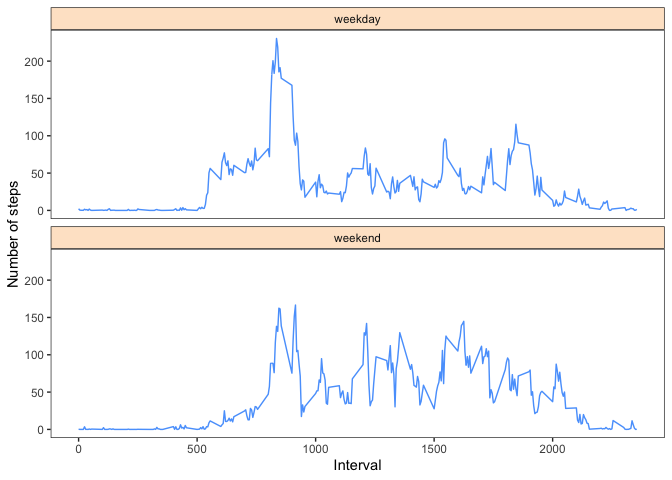

```r
knitr::opts_chunk$set(cache = F, echo = TRUE)

library(readr)
library(magrittr)
library(ggplot2)
library(dplyr)
```

```
## 
## Attaching package: 'dplyr'
```

```
## The following objects are masked from 'package:stats':
## 
##     filter, lag
```

```
## The following objects are masked from 'package:base':
## 
##     intersect, setdiff, setequal, union
```

```r
if(!file.exists("./data")){ dir.create("./data") }

setwd("./data")
```

## Loading and preprocessing the data
1. Load the data (i.e. read.csv())  
2. Process/transform the data (if necessary) into a format suitable for your analysis  


```r
activity_data <- readr::read_csv(unzip("activity.zip", "activity.csv"))
```

```
## 
## ── Column specification ────────────────────────────────────────────────────────
## cols(
##   steps = col_double(),
##   date = col_date(format = ""),
##   interval = col_double()
## )
```

```r
str(activity_data)
```

```
## tibble [17,568 × 3] (S3: spec_tbl_df/tbl_df/tbl/data.frame)
##  $ steps   : num [1:17568] NA NA NA NA NA NA NA NA NA NA ...
##  $ date    : Date[1:17568], format: "2012-10-01" "2012-10-01" ...
##  $ interval: num [1:17568] 0 5 10 15 20 25 30 35 40 45 ...
##  - attr(*, "spec")=
##   .. cols(
##   ..   steps = col_double(),
##   ..   date = col_date(format = ""),
##   ..   interval = col_double()
##   .. )
```


## What is mean total number of steps taken per day?

For this part of the assignment, you can ignore the missing values in the dataset.

1. Calculate the total number of steps taken per day


```r
step_sums <- aggregate(steps ~ date, activity_data, sum, na.rm = T)
step_sums %>% head()
```

```
##         date steps
## 1 2012-10-02   126
## 2 2012-10-03 11352
## 3 2012-10-04 12116
## 4 2012-10-05 13294
## 5 2012-10-06 15420
## 6 2012-10-07 11015
```

2. Make a histogram of the total number of steps taken each day


```r
sum_plot <- qplot(step_sums$steps, geom = "histogram", binwidth = 25000/5) 
print(sum_plot)
```

<!-- -->

3. Calculate and report the mean and median of the total number of steps taken per day


```r
activity_data %>%
  group_by(date) %>%
  summarise(
    sum = sum(steps, na.rm = T), 
    mean = mean(steps, na.rm = T), 
    median = median(steps, na.rm = T)) -> mean_med
```

```
## `summarise()` ungrouping output (override with `.groups` argument)
```

```r
mean_med
```

```
## # A tibble: 61 x 4
##    date         sum    mean median
##    <date>     <dbl>   <dbl>  <dbl>
##  1 2012-10-01     0 NaN         NA
##  2 2012-10-02   126   0.438      0
##  3 2012-10-03 11352  39.4        0
##  4 2012-10-04 12116  42.1        0
##  5 2012-10-05 13294  46.2        0
##  6 2012-10-06 15420  53.5        0
##  7 2012-10-07 11015  38.2        0
##  8 2012-10-08     0 NaN         NA
##  9 2012-10-09 12811  44.5        0
## 10 2012-10-10  9900  34.4        0
## # … with 51 more rows
```

## What is the average daily activity pattern?  

1. Make a time series plot (i.e. type = "l") of the 5-minute interval (x-axis) and the average number of steps taken, averaged across all days (y-axis)


```r
step_interv <- aggregate(steps ~ interval + date, activity_data, mean, na.rm = T)

plot(step_interv$interval, step_interv$steps, type = "l")
```

<!-- -->


2. Which 5-minute interval, on average across all the days in the dataset, contains the maximum number of steps?


```r
step_interv[step_interv$steps == max(step_interv$steps), ]
```

```
##       interval       date steps
## 14476      615 2012-11-27   806
```

615

## Imputing missing values

1. Calculate and report the total number of missing values in the dataset (i.e. the total number of rows with NAs)  


```r
sapply(activity_data, function(x) sum(is.na(x)))
```

```
##    steps     date interval 
##     2304        0        0
```

```r
# NAs by day:
# Days with NAs:
table(activity_data$date, is.na(activity_data$steps)) %>% as.data.frame() -> days_w_nas
names(days_w_nas) <- c("day", "has_nas", "freq")
days_w_nas %>% filter(freq > 0 & has_nas == TRUE) %>% select(day)
```

```
##          day
## 1 2012-10-01
## 2 2012-10-08
## 3 2012-11-01
## 4 2012-11-04
## 5 2012-11-09
## 6 2012-11-10
## 7 2012-11-14
## 8 2012-11-30
```

2. Devise a strategy for filling in all of the missing values in the dataset. The strategy does not need to be sophisticated. For example, you could use the mean/median for that day, or the mean for that 5-minute interval, etc.  

Imputing missing values using the mean for that 5-minute interval.  

```r
activity_data$step_imp <- ave(activity_data$steps, activity_data$interval, 
                          FUN = function(x) ifelse(is.na(x), mean(x, na.rm = TRUE), x))
# activity_data$step_imp %>% head
sapply(activity_data, function(x) sum(is.na(x)))
```

```
##    steps     date interval step_imp 
##     2304        0        0        0
```

3. Create a new dataset that is equal to the original dataset but with the missing data filled in.  


```r
activity_data %>% select(-c("steps")) %>%
  {.} -> imputed_dataset
  
#imputed_dataset %>% head
```

4. Make a histogram of the total number of steps taken each day


```r
imputed_dataset %>% head(3)
```

```
## # A tibble: 3 x 3
##   date       interval step_imp
##   <date>        <dbl>    <dbl>
## 1 2012-10-01        0    1.72 
## 2 2012-10-01        5    0.340
## 3 2012-10-01       10    0.132
```

```r
step_sums_imp <- aggregate(step_imp ~ date, imputed_dataset, sum, na.rm = T)
step_sums_imp %>% head(3)
```

```
##         date step_imp
## 1 2012-10-01 10766.19
## 2 2012-10-02   126.00
## 3 2012-10-03 11352.00
```

```r
sum_imp_plot <- qplot(step_sums$steps, geom = "histogram", binwidth = 25000/5) 
print(sum_plot)
```

<!-- -->

Calculate and report the mean and median total number of steps taken per day.


```r
imputed_dataset %>%
  group_by(date) %>%
  summarise(
    sum = sum(step_imp, na.rm = T), 
    mean = mean(step_imp, na.rm = T), 
    median = median(step_imp, na.rm = T)) %>%
#%T>% head(3) %>%
    {.} -> mean_med_imp
```

```
## `summarise()` ungrouping output (override with `.groups` argument)
```

```r
mean_med_imp
```

```
## # A tibble: 61 x 4
##    date          sum   mean median
##    <date>      <dbl>  <dbl>  <dbl>
##  1 2012-10-01 10766. 37.4     34.1
##  2 2012-10-02   126   0.438    0  
##  3 2012-10-03 11352  39.4      0  
##  4 2012-10-04 12116  42.1      0  
##  5 2012-10-05 13294  46.2      0  
##  6 2012-10-06 15420  53.5      0  
##  7 2012-10-07 11015  38.2      0  
##  8 2012-10-08 10766. 37.4     34.1
##  9 2012-10-09 12811  44.5      0  
## 10 2012-10-10  9900  34.4      0  
## # … with 51 more rows
```

### Do these values differ from the estimates from the first part of the assignment? 
Yes

### What is the impact of imputing missing data on the estimates of the total daily number of steps?


```r
summary(activity_data$steps)
```

```
##    Min. 1st Qu.  Median    Mean 3rd Qu.    Max.    NA's 
##    0.00    0.00    0.00   37.38   12.00  806.00    2304
```


```r
summary(imputed_dataset$step_imp)
```

```
##    Min. 1st Qu.  Median    Mean 3rd Qu.    Max. 
##    0.00    0.00    0.00   37.38   27.00  806.00
```


No impact

## Are there differences in activity patterns between weekdays and weekends?

For this part the weekdays() function may be of some help here. Use the dataset with the filled-in missing values for this part.

1. Create a new factor variable in the dataset with two levels – “weekday” and “weekend” indicating whether a given date is a weekday or weekend day. 


```r
imputed_dataset$weekday <- weekdays(imputed_dataset$date, abbreviate = T)
weekends <- list("Sat", "Sun")
is_weekend = function(x) {
  if_else(x %in% weekends, "weekend", "weekday")
}
imputed_dataset$is_weekend <- as.factor(sapply(imputed_dataset$weekday, is_weekend))

imputed_dataset %>% head(3)
```

```
## # A tibble: 3 x 5
##   date       interval step_imp weekday is_weekend
##   <date>        <dbl>    <dbl> <chr>   <fct>     
## 1 2012-10-01        0    1.72  Mon     weekday   
## 2 2012-10-01        5    0.340 Mon     weekday   
## 3 2012-10-01       10    0.132 Mon     weekday
```

2. Make a panel plot containing a time series plot (i.e. type = "l") of the 5-minute interval (x-axis) and the average number of steps taken, averaged across all weekday days or weekend days (y-axis). See the README file in the GitHub repository to see an example of what this plot should look like using simulated data.


```r
step_interv_week <- aggregate(step_imp ~ interval + is_weekend, imputed_dataset, mean, na.rm = T)

p_avg_activ_imp <- ggplot(data = step_interv_week, 
                     aes(x = interval,
                         y = step_imp)) +
  geom_line(color = rgb(90, 163, 252, maxColorValue = 255)) +
  facet_wrap(~is_weekend, nrow = 2) + 
  labs(x = "Interval", y = "Number of steps") +
  theme_bw() +
  theme(panel.grid.major = element_blank(),
        panel.grid.minor = element_blank(), 
        strip.background = element_rect(fill = rgb(254,	229, 205, maxColorValue = 255))
        )

p_avg_activ_imp
```

<!-- -->
